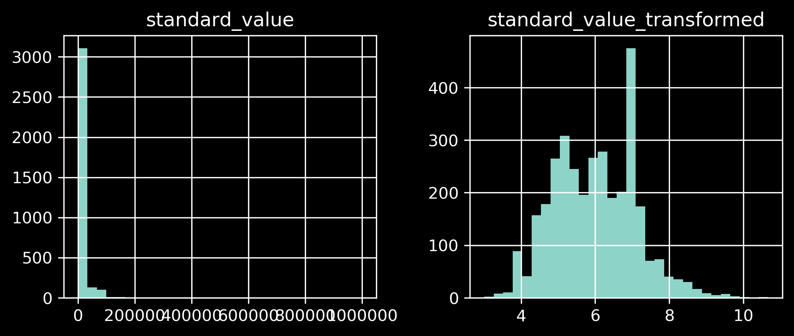
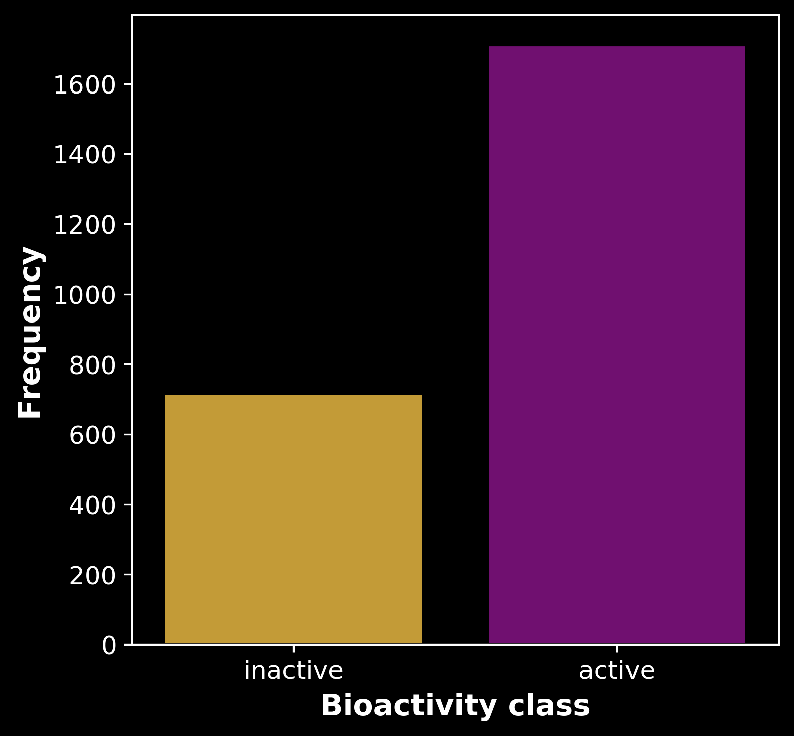
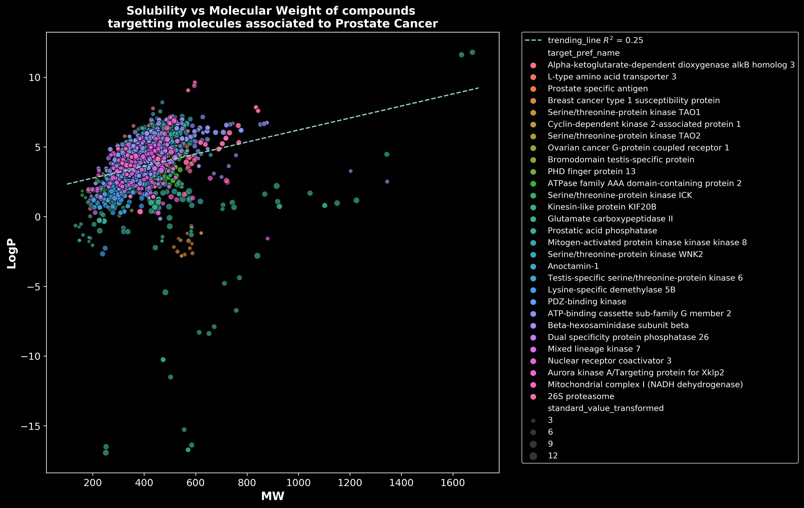
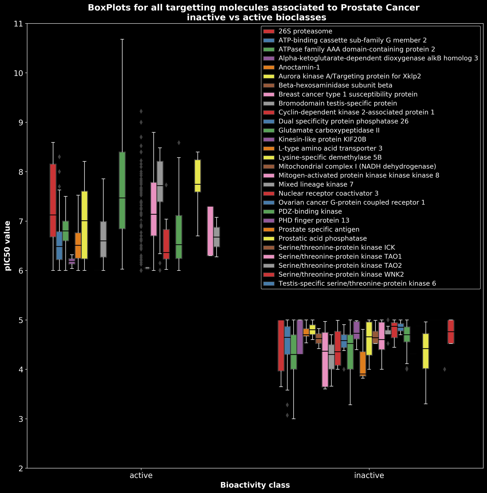
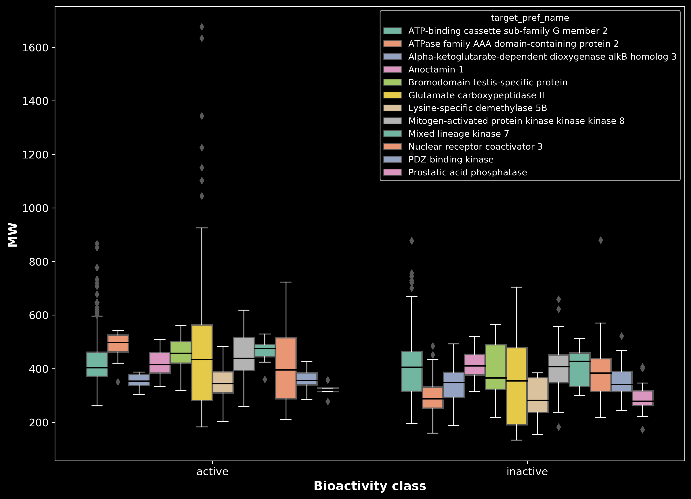
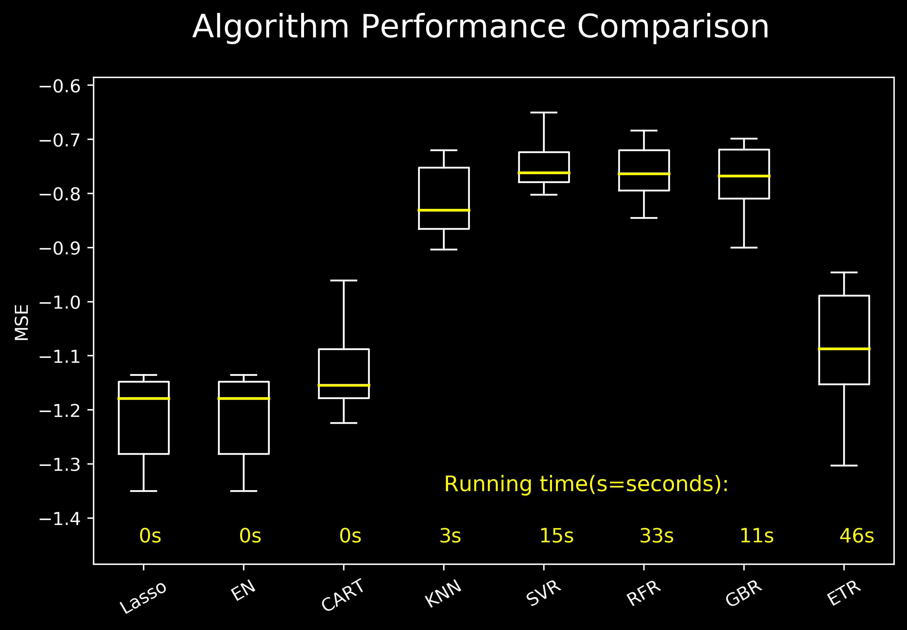
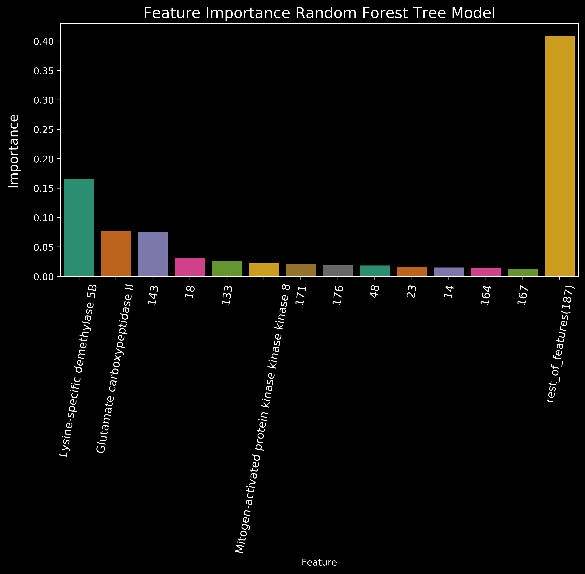
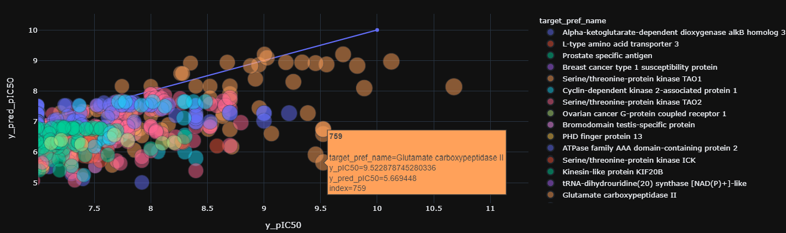
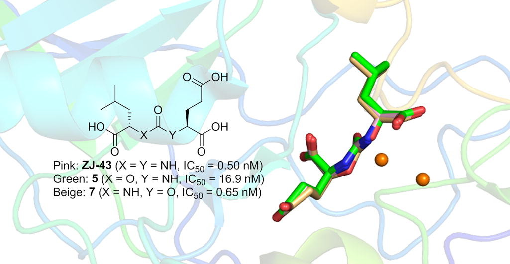

# drug_discovery_project

## Description: 

The goal of this project is to use data from the ChEMBL Database to train a model that can predict the activity of a potential drug based on its chemical properties.
This can be used to study the **chemical features** that are critical in the drug effectiveness, and to study best **molecular targets** to act upon the specific disease.

In this project I will focus on studying possible drugs targeting proteins with a role in **prostate cancer** development.

*Note: November and the movember movement inspired me to do this project.
This movement that try to raise awareness of men's health issues, such as prostate cancer during the month of November. [Read more about movember here](https://en.wikipedia.org/wiki/Movember).*

 ## Code and Resources Used:

**Python Version**: 3.7

**Packages**: pandas, numpy, chembl_webresource_client, scipy, os, glob, datetime, rdkit, sklearn, matplotlib, seaborn and plotly.

# 1. Downloading Bioactivity Data from ChEML

[*ChEMBL Database*](https://www.ebi.ac.uk/chembl/) is a database that contains curated bioactivity data of more than 2 million compounds.
It is compiled from more than 76,000 documents, 1.2 million assays and the data spans 13,000 targets and 1,800 cells and 33,000 indications.

 Here I retrieved bioactivity data **as IC$_{50}$** for compounds against all human prostate **single protein** or **protein complex** targets.
 
 # 2. Data Cleaning and Preprocessing:
 
 * **drop nan** values
 * **feature engineering** to create a bioactivity_class feature (active, intermediate, innactive)
 * Calculate **Lipinski descriptors** (a set of rules for evaluating the **druglikeness** of compounds)
 * convert IC50 values to pIC50 (negative logaritmic transformation) to obtain values closer to a **normal distribution** (See figure below)
 
  
 
 # 3. Exploratory Data Analysis:  
**Chemical Space Analysis using the Lipinski descriptors**

* Frequency distribution of the active and innactive bioactivity classes:

 
 
* Scatter plot of the MW vs the solubility to see the relactionship between these two features:
 
 

* Boxplots to see the value distributions within each bioactive class:

 
 
 * Boxplots and mann-whitney tests to check for statistical differences between each of the Lipinski variables for each of the prostate cancer target groups.
 i.e: Molecular Weight (MW)
 
 
 
 # 4. Dataset Preparation:
 
* Using the **Padel- Descriptor Software** developed by the authors of [this paper](http://onlinelibrary.wiley.com/doi/10.1002/jcc.21707/abstract), we calculated the fingerprint descriptors for all the 3375 molecules of our dataset.

* The software calculates molecular descriptors and fingerprints. It currently calculates 1875 descriptors (1444 1D, 2D descriptors and 431 3D descriptors) and 12 types of fingerprints (total 16092 bits). 

* The Pubchem features basically construct a **molecular fingerprint** of each molecule in the data set. Based on this data, the model will be able to predict the level of activity of a drug based on its finger print.

# 5. Model Building:

* Create the model dataframe, remove the PubChem features with low variance and split the data **(80/20 train/test ratio)**
* Assess model performance: Different Regression algorithms were tested, and two best performing algos were (SVR and RFR) were selected for further tunning.
 **cross-validation** with 10 splits, and **negative mean squared error** as performance metric.
 
 

* **Fine Tunning and Model Evaluation**: 
SVR and RFR were fined tunned using GridSearchCV. RFR perfrom the best with the following hyperparameters were optimized to maximiza the model performance in both the train and test set while avoiding overfitting:
    * n_estimators
    * Max_depth
    * min_sample_leaf
    * min_samples_split
 * **Score**: The model RandomForestRegressor(n_estimators=45, max_depth=10, min_samples_leaf=4, min_samples_split=2) scored **0.60** and **0.48** on the train and test set respectively.
 
 * Feature importance:
 
  
 
 # 6. Conclussions:
 
**6.1 PubChem features.**

We observe that, based on our model, some of the **PubChem features** that seem to be **most important** in determining the activity of a drug are: 143, 18, 133, 171, 176 and 48.

It would be interesting to investigate this further and try to associate this with the activity of the drup, which could sed some ligth into possible modes of action, and development of more effective drugs.

**6.2 Molecular Cancer Target Groups** 🎯.
We also see that:
* **Lysine-specific demethylase 5B (KDM5B)**
* **Glutamate carboxipeptidase II (GCPII)**
* **Mitogen-activated protein kinase 8 (MAP3K8)**

  
 
They have the largest activities among all molecular targets. Hence they may be the **best targets to develop drugs for treating cancer**.

**6.3 Literature** 📚:

To continue this project would be interesting to further study this three proteins:

* Nice Review for **KDM5B**: [2017  KDM5B in development and cancer](https://www.ncbi.nlm.nih.gov/pmc/articles/PMC5352456/) ->  "*Given its association with tumor progression and prognosis of cancer patients, KDM5B was proposed to be a novel target for the prevention and treatment of human cancers*".

* Furthemore, It seems that there is already a strong focus on finding inhibitors of **GCPII**: [2019 Structural and computational basis for potent inhibition of glutamate carboxypeptidase II by carbamate-based inhibitors](https://www.sciencedirect.com/science/article/abs/pii/S0968089618316110). *"These insights should be of particular importance in future efforts to design and develop GCPII inhibitors for optimal inhibitory potency"*

* MAP3K8 acts as a tumor suppressor, and there is a **significant elevation in the cancer tissue or/and cells**. **Nonetheless, this may not be a good molecular target** since MAPK 8 acts as a MAP3K and is widely expressed in the brain, intestine, kidney, skeletal muscles, and the immunological system, hence a drug could have multiple adverse effects. [Read more in this paper from 2015](https://academic.oup.com/mend/article/29/5/703/2556237).

* In the picture below we can see the chemical structure of **three potential drugs targetting Glutamate carboxipeptidase II** described in the 2019 paper above.

 

